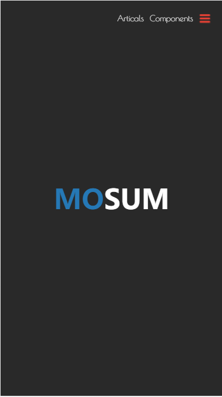
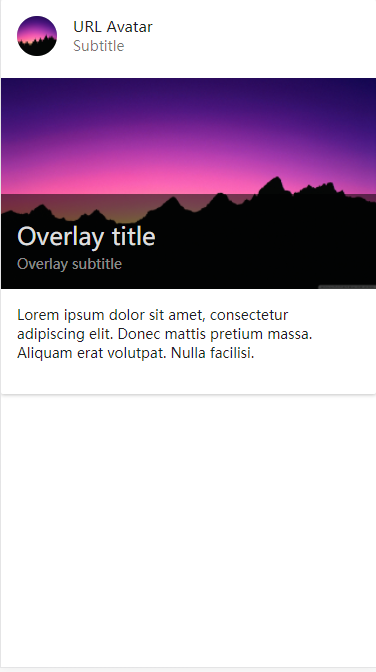
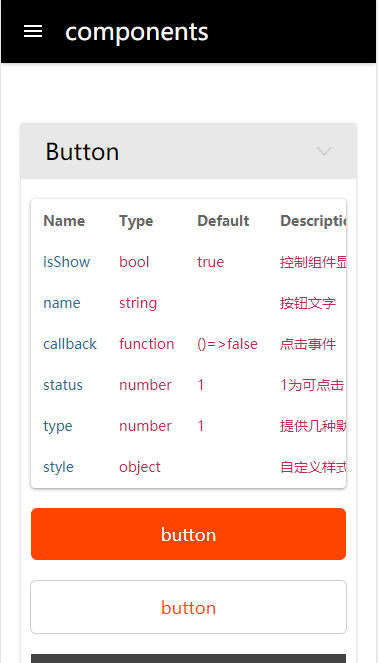

# PersonalWebsite
## 2018年2月14日
个人网站，主要是移动版，后期会对pc版做兼容，目前开发了
- 首页
- 文章页基本模块
- 组件页按钮和弹窗模块

### 首页
首页主要还是一个swiper的应用

### 文章页
文章页的很多组件是用的materialUI的组件，目前后台存储与接口还没有开发完成。

### 组件页
组件页的样式有点模仿materialUI的页面风格，但是组件都是自己学习与工作中需要用到的常用组件，比较简单，也不存在抄袭其它UI库的组件的行为。

### 使用
**可以通过**    
npm i 安装模块  
npm start 启动项目，在浏览器中localhost:3060查看，自己改地址。。。   

也可以直接打开dist中的index.html查看   
